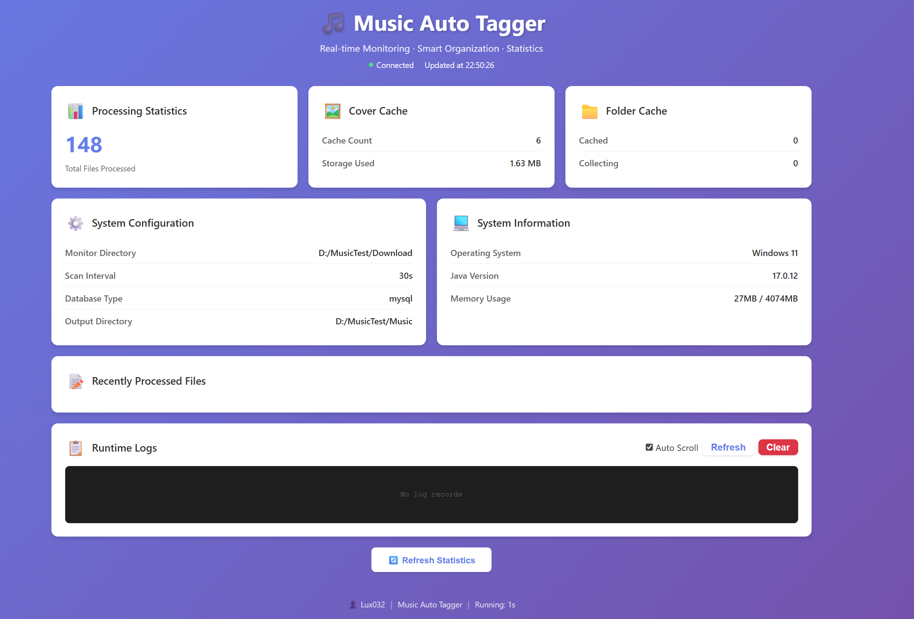

# 🎵 Music Auto Tagger | Automated Music Library Organizer

<div align="center">

[](https://www.java.com/)
[](https://www.docker.com/)
[](https://musicbrainz.org/)
[](https://lrclib.net/)
[](LICENSE)

[English](README.md) | [简体中文](README_ZH.md)

</div>

**Music Auto Tagger** is an automated music library organizer based on **audio fingerprinting** and **duration sequence fingerprinting**. Designed for NAS and server environments, it monitors your download folder, identifies music files, fetches comprehensive metadata (including lyrics), and organizes them into a clean structure.

> **Core Value**: Say goodbye to messy music folders. Automatically tag, cover, and organize your music library to perfection.

## 📊 Web Monitoring Dashboard



The built-in real-time monitoring dashboard provides:
- 📊 Real-time statistics and processing progress
- 📝 Recently processed files with detailed metadata
- 📋 Live system logs with auto-scroll
- ⚙️ System configuration and status overview

## ✨ Key Features

- 🎧 **Audio Fingerprinting**: Uses **Chromaprint (AcoustID)** to accurately identify files even with garbled filenames (e.g., `track01.mp3`).
- 📝 **Authoritative Metadata**: Sources data from **MusicBrainz** to automatically complete Title, Artist, Album, Year, **Composer**, **Lyricist**, and more.
- 📜 **Synced Lyrics**: 🆕 Integrates with **LrcLib** to automatically download and embed **synced lyrics (.lrc)**, perfect for modern players.
- 🖼️ **HD Cover Art**: Automatically downloads and embeds high-quality album art from the Cover Art Archive.
- 📁 **Automated Organization**: Automatically renames and sorts files into a `Artist/Album/Title` structure.
- 🤖 **Unattended Operation**: Works seamlessly with qBittorrent/Transmission to process downloads automatically upon completion.
- ⚡ **Smart Scan Optimization**: 🆕 **Two-tier identification + folder-level caching**
    - **Tier 1: Quick Scan** - Tag & duration sequence matching, passes at 90% accuracy
    - **Tier 2: Fingerprint** - Only triggered when quick scan fails, ensures high recognition rate
    - **Folder-level Caching** - Subsequent files in the same album use cached results, skip all scans
    - **Performance Boost**: Processing a 16-track album requires only 1 full scan + 15 cache lookups
- 💾 **Dual Persistence Modes**:
    - **File Mode (Default)**: Uses a CSV file to track processed files. Zero config, ready out of the box for personal use.
    - **MySQL Mode**: Supports external database connection for massive libraries and high concurrency.
- 🐳 **Docker Ready**: Provides lightweight Docker images compatible with Synology, QNAP, Unraid, and other NAS systems.
- 🔄 **Smart Retry**: Automatically handles network failures with retry logic and isolates failed files for later inspection.
- 📊 **Web Monitoring Dashboard**: 🆕 Built-in real-time monitoring dashboard to visualize processing progress, system status, and runtime logs.
- 🌐 **Multi-language Support**: 🆕 Supports both Chinese and English interfaces, easily switchable via configuration file, providing localized experience for global users.

## ⚠️ Best Practice: How to Get the Most Accurate Results

Since music releases are extremely complex (Singles, EPs, Albums, Compilations, Deluxe Editions, etc.), to ensure the tool accurately categorizes your music into the correct albums, it is **highly recommended** to follow this practice:

> **Please place audio files from the same album (or single) into a separate folder** before processing them with this tool.

❌ **Not Recommended**: Dumping hundreds of songs from different artists and albums into a single directory.
✅ **Recommended**:
  - `/Downloads/Jay_Chou_Fantasy/` (Contains songs from the Fantasy album)
  - `/Downloads/Adele_21/` (Contains songs from the 21 album)

**Reason**: When files are isolated in separate folders, the program can better determine that they belong to the same album based on context, avoiding misidentification of album tracks as "Best Of" compilations or "Single" versions.
## 🚀 Quick Start (Docker Compose)

The easiest way to run the application. No Java installation required.

1.  **Download Config Template**
    Download `config.properties.example` from the repository and rename it to `config.properties`.

2.  **Get API Key (Free)**
    Visit [AcoustID](https://acoustid.org/new-application) to apply for an API Key and add it to your config:
    ```properties
    acoustid.apiKey=YOUR_API_KEY_HERE
    ```

3.  **Create `docker-compose.yml`**
    ```yaml
    version: '3.8'
    services:
      music-tagger:
        image: ghcr.io/lux032/musicautotagger:latest
        container_name: music-tagger
        ports:
          - "8080:8080"                         # Web monitoring dashboard port
        volumes:
          # Monitor directory: Source folder containing music files to process
          # Left side (host): Your actual download folder path
          # Right side (container): Must match 'monitor.directory' in config.properties (default: /music)
          - /path/to/downloads:/music
          
          # Output directory: Destination for organized music library
          # Left side (host): Your music library storage location
          # Right side (container): Must match 'monitor.outputDirectory' in config.properties (default: /app/tagged_music)
          - /path/to/music_library:/app/tagged_music
          
          # Configuration file
          - ./config.properties:/app/config.properties
          
          # Failed files directory (for identification failures)
          - /path/to/failed:/app/failed_files
          
          # Partial recognition directory (optional, for files with tags/cover but failed fingerprinting)
          - /path/to/partial:/app/partial_files
          
          # Cover cache directory (persists downloaded covers across restarts)
          - /path/to/cover_cache:/app/.cover_cache
          
          # Logs directory (persists processing logs)
          - /path/to/logs:/app/logs
        restart: unless-stopped
    ```
    
    **Volume Mounting Explained:**
    
    | Host Path (Left) | Container Path (Right) | Purpose | Required |
    |-----------------|------------------------|---------|----------|
    | `/path/to/downloads` | `/music` | Source folder to monitor | ✅ Yes |
    | `/path/to/music_library` | `/app/tagged_music` | Organized music output | ✅ Yes |
    | `./config.properties` | `/app/config.properties` | Configuration file | ✅ Yes |
    | `/path/to/failed` | `/app/failed_files` | Failed file isolation | ✅ Yes |
    | `/path/to/partial` | `/app/partial_files` | Partial recognition files (optional) | ⚠️ Optional |
    | `/path/to/cover_cache` | `/app/.cover_cache` | Cover art cache | ✅ Yes |
    | `/path/to/logs` | `/app/logs` | Processing logs | ✅ Yes |
    
    **Important Notes:**
    - The **left side** paths are on your **host machine** (e.g., your NAS or server)
    - The **right side** paths are **inside the Docker container**
    - The container paths on the right side must match the corresponding settings in [`config.properties`](config.properties.example)
    - Example for NAS users:
      ```yaml
      volumes:
        - /share/Downloads/Music:/music                    # QNAP/Synology downloads folder
        - /share/Music:/app/tagged_music                   # Your music library
        - /share/Docker/music-tagger/config.properties:/app/config.properties
      ```

4.  **Start Service**
    ```bash
    docker-compose up -d
    ```

5.  **Access Web Monitoring Dashboard**

    After starting, open `http://localhost:8080` in your browser to view the real-time monitoring dashboard.

    Dashboard features:
    - 📊 **Real-time Statistics**: Processed files count, cover cache, folder cache, etc.
    - 📝 **Recent Files**: View details of recently processed music files
    - 📋 **Runtime Logs**: Real-time system logs with auto-scroll support
    - ⚙️ **System Info**: View configuration parameters and system status

## 💻 Local Installation

If you prefer to run it locally for development or testing:

### Prerequisites
- JDK 17+
- Maven 3.6+
- [Chromaprint (fpcalc)](https://acoustid.org/chromaprint) (Must be added to system PATH)

### Build & Run
```bash
# 1. Build
mvn clean package

# 2. Config
cp config.properties.example config.properties
# Edit config.properties and fill in API Key

# 3. Run
java -jar target/MusicDemo-1.0-SNAPSHOT.jar

# 4. Access Web Dashboard
# Open http://localhost:8080 in your browser
```

## 📚 Documentation

- **QNAP NAS Users**: See [QNAP Deployment Guide](docs/QNAP_DEPLOYMENT_GUIDE.md) (Chinese)
- **Database Setup**: Default is file-based. For MySQL setup, see [Database Setup](docs/DATABASE_SETUP.md)
- **Windows Guide**: [Windows Build & Test](docs/WINDOWS_BUILD_GUIDE.md)

## ⚙️ Configuration Reference

For a complete template, see `config.properties.example`. Here are the most common settings:

### 📁 Paths
| Setting | Description | Default |
|--------|------|--------|
| `monitor.directory` | Source directory to monitor (Inside Docker) | `/music` |
| `monitor.outputDirectory` | Target output directory (Inside Docker) | `/app/tagged_music` |
| `file.failedDirectory` | Directory for failed files | `/app/failed_files` |
| `file.partialDirectory` | Directory for partial recognition files (Optional, must have cover) | `/app/partial_files` |
| `cache.coverArtDirectory` | Cover art cache directory | `/app/.cover_cache` |
| `logging.processedFileLogPath` | Processed file log path | `/app/logs/processed_files.log` |

### 🔑 API
| Setting | Description | Default |
|--------|------|--------|
| `acoustid.apiKey` | **[Required]** AcoustID API Key | - |
| `musicbrainz.userAgent` | User-Agent for API requests | `MusicDemo/1.0 ( your-email@example.com )` |
| `monitor.scanInterval` | Scan interval (seconds) | `30` |

### 🛠️ Features
| Setting | Description | Default |
|--------|------|--------|
| `file.autoRename` | Rename files automatically | `true` |
| `file.maxRetries` | Max retries for network errors | `3` |
| `logging.detailed` | Enable detailed logging | `true` |
| `lyrics.exportToFile` | Export lyrics as separate .lrc file (for Plex and other media servers) | `false` |
| `release.countryPriority` | Preferred release countries (e.g., `JP,US,GB,XW`). Only affects version selection within the same album | Empty |

### 💾 Database
| Setting | Description | Default |
|--------|------|--------|
| `db.type` | Database type (`file` or `mysql`) | `mysql` |
| `db.mysql.host` | MySQL Host | `localhost` |
| `db.mysql.port` | MySQL Port | `3306` |
| `db.mysql.database` | Database Name | `music_demo` |
| `db.mysql.username` | Username | `root` |
| `db.mysql.password` | Password | - |

### 🌐 Proxy (Optional)
| Setting | Description | Default |
|--------|------|--------|
| `proxy.enabled` | Enable HTTP Proxy | `false` |
| `proxy.host` | Proxy Host | `127.0.0.1` |
| `proxy.port` | Proxy Port | `7890` |

## 🤝 Contribution

Issues and Pull Requests are welcome!

If this project helps you, please consider giving it a ⭐ **Star**!

## 📄 License

This project is licensed under the [MIT License](LICENSE).

### License Summary

The MIT License is a permissive open source license that allows you to:
- ✅ Commercial use
- ✅ Modification
- ✅ Distribution
- ✅ Private use

**The only requirement** is to include the copyright notice and license notice in all copies or substantial portions of the software.

### Third-Party Services

This tool relies on the following third-party services. Please respect their respective Terms of Service:
- [MusicBrainz](https://musicbrainz.org/) - Music metadata service
- [AcoustID](https://acoustid.org/) - Audio fingerprinting service
- [LrcLib](https://lrclib.net/) - Lyrics service
- [Cover Art Archive](https://coverartarchive.org/) - Album art service

---
**Disclaimer**: This tool relies on third-party services (MusicBrainz, AcoustID, LrcLib). Please respect their Terms of Service.