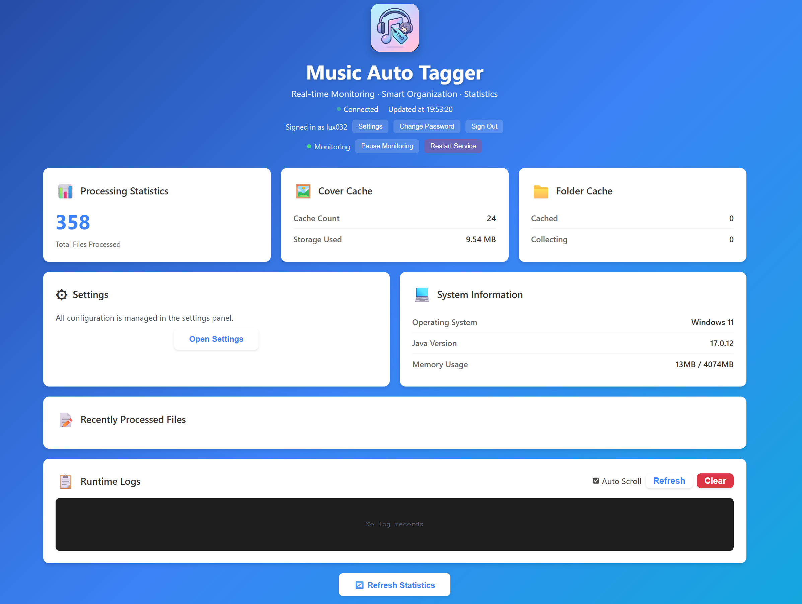

# 🎵 Music Auto Tagger | Automated Music Library Organizer

<div align="center">


[](https://www.java.com/)
[](https://www.docker.com/)
[](https://musicbrainz.org/)
[](https://lrclib.net/)
[](LICENSE)

[English](README.md) | [简体中文](README_ZH.md)

</div>

**Music Auto Tagger** is an automated music library organizer based on **audio fingerprinting** and **duration sequence fingerprinting**. Designed for NAS and server environments, it monitors your download folder, identifies music files, fetches comprehensive metadata (including lyrics), and organizes them into a clean structure.

> **Core Value**: Say goodbye to messy music folders. Automatically tag, cover, and organize your music library to perfection.

## 📊 Web Monitoring Dashboard



The built-in real-time monitoring dashboard provides:
- 📊 Real-time statistics and processing progress
- 📝 Recently processed files with detailed metadata
- 📋 Live system logs with auto-scroll
- ⚙️ System configuration and status overview

## ✨ Key Features

- 🎧 **Audio Fingerprinting**: Uses **Chromaprint (AcoustID)** to accurately identify files even with garbled filenames (e.g., `track01.mp3`).
- 📝 **Authoritative Metadata**: Sources data from **MusicBrainz** to automatically complete Title, Artist, Album, Year, **Composer**, **Lyricist**, and more.
- 📜 **Synced Lyrics**: 🆕 Integrates with **LrcLib** to automatically download and embed **synced lyrics (.lrc)**, perfect for modern players.
- 🖼️ **HD Cover Art**: Automatically downloads and embeds high-quality album art from the Cover Art Archive.
- 📁 **Automated Organization**: Automatically renames and sorts files into a `Artist/Album/Title` structure.
- 🤖 **Unattended Operation**: Works seamlessly with qBittorrent/Transmission to process downloads automatically upon completion.
- ⚡ **Smart Scan Optimization**: 🆕 **Two-tier identification + folder-level caching**
    - **Tier 1: Quick Scan** - Tag & duration sequence matching, passes at 90% accuracy
    - **Tier 2: Fingerprint** - Only triggered when quick scan fails, ensures high recognition rate
    - **Folder-level Caching** - Subsequent files in the same album use cached results, skip all scans
    - **Performance Boost**: Processing a 16-track album requires only 1 full scan + 15 cache lookups
- 💾 **Dual Persistence Modes**:
    - **File Mode (Default)**: Uses a CSV file to track processed files. Zero config, ready out of the box for personal use.
    - **MySQL Mode**: Supports external database connection for massive libraries and high concurrency.
- 🐳 **Docker Ready**: Provides lightweight Docker images compatible with Synology, QNAP, Unraid, and other NAS systems.
- 🔄 **Smart Retry**: Automatically handles network failures with retry logic and isolates failed files for later inspection.
- 📊 **Web Monitoring Dashboard**: 🆕 Built-in real-time monitoring dashboard to visualize processing progress, system status, and runtime logs.
- 🌐 **Multi-language Support**: 🆕 Supports both Chinese and English interfaces, easily switchable via configuration file, providing localized experience for global users.
- 🤖 **LLM Artist Matching**: 🆕 Optional LLM-assisted matching for partial recognition scenarios. When files have tags and covers but fingerprint recognition fails, uses LLM to fuzzy match artist names (supports romanization, aliases, translations, etc.) and automatically archives to the correct artist folder. Supports multiple LLM endpoints with automatic retry.

## ⚠️ Best Practice: How to Get the Most Accurate Results

Since music releases are extremely complex (Singles, EPs, Albums, Compilations, Deluxe Editions, etc.), to ensure the tool accurately categorizes your music into the correct albums, it is **highly recommended** to follow this practice:

> **Please place audio files from the same album (or single) into a separate folder** before processing them with this tool.

❌ **Not Recommended**: Dumping hundreds of songs from different artists and albums into a single directory.
✅ **Recommended**:
  - `/Downloads/Jay_Chou_Fantasy/` (Contains songs from the Fantasy album)
  - `/Downloads/Adele_21/` (Contains songs from the 21 album)

**Reason**: When files are isolated in separate folders, the program can better determine that they belong to the same album based on context, avoiding misidentification of album tracks as "Best Of" compilations or "Single" versions.
## Quick Start (Docker Compose)

The easiest way to run the application. Configuration is done in the web UI after login.

1.  **Create docker-compose.yml**
    ```yaml
    version: '3.8'
    services:
      music-tagger:
        image: ghcr.io/lux032/musicautotagger:latest
        container_name: music-tagger
        ports:
          - "8080:8080"  # Web dashboard
        environment:
          - PUID=1000
          - PGID=1000
          - UMASK=022
        volumes:
          - /path/to/downloads:/music
          - /path/to/music_library:/app/tagged_music
          - ./data:/app/data
          - ./config.properties:/app/config.properties
        restart: unless-stopped
    ```

    Set `PUID`/`PGID` to match the NAS user/group that owns your mounted folders. `UMASK` controls default permissions.

2.  **Start Service**
    ```bash
    docker-compose up -d
    ```

3.  **Access Web Monitoring Dashboard**

    Open `http://localhost:8080` in your browser.
    - First visit will prompt you to create an admin account (stored in `data/admin.json`).
    - If `config.properties` is missing, the app auto-generates it on startup.
    - All settings (API keys, database, proxy, paths, language) are managed in the web UI.

## 💻 Local Installation

If you prefer to run it locally for development or testing:

### Prerequisites
- JDK 17+
- Maven 3.6+
- [Chromaprint (fpcalc)](https://acoustid.org/chromaprint) (Must be added to system PATH)
- [FFmpeg](https://ffmpeg.org/) (Must be added to system PATH)

### Build & Run
```bash
# 1. Build
mvn clean package

# 2. Run
java -jar target/MusicDemo-1.0-SNAPSHOT.jar

# 3. Access Web Dashboard
# Open http://localhost:8080 in your browser
```

Configuration is created automatically on first run.
All settings (API keys, database, proxy, paths, language) are managed in the web UI after login.

## 📚 Documentation

- **QNAP NAS Users**: See [QNAP Deployment Guide](docs/QNAP_DEPLOYMENT_GUIDE.md) (Chinese)
- **Database Setup**: Default is file-based. For MySQL setup, see [Database Setup](docs/DATABASE_SETUP.md)
- **Windows Guide**: [Windows Build & Test](docs/WINDOWS_BUILD_GUIDE.md)

## 🤝 Contribution

Issues and Pull Requests are welcome!

If this project helps you, please consider giving it a ⭐ **Star**!

## 📄 License

This project is licensed under the [MIT License](LICENSE).

### License Summary

The MIT License is a permissive open source license that allows you to:
- ✅ Commercial use
- ✅ Modification
- ✅ Distribution
- ✅ Private use

**The only requirement** is to include the copyright notice and license notice in all copies or substantial portions of the software.

### Third-Party Services

This tool relies on the following third-party services. Please respect their respective Terms of Service:
- [MusicBrainz](https://musicbrainz.org/) - Music metadata service
- [AcoustID](https://acoustid.org/) - Audio fingerprinting service
- [LrcLib](https://lrclib.net/) - Lyrics service
- [Cover Art Archive](https://coverartarchive.org/) - Album art service
- [FFmpeg](https://ffmpeg.org/) - Audio processing toolkit

---
**Disclaimer**: This tool relies on third-party services (MusicBrainz, AcoustID, LrcLib). Please respect their Terms of Service.
