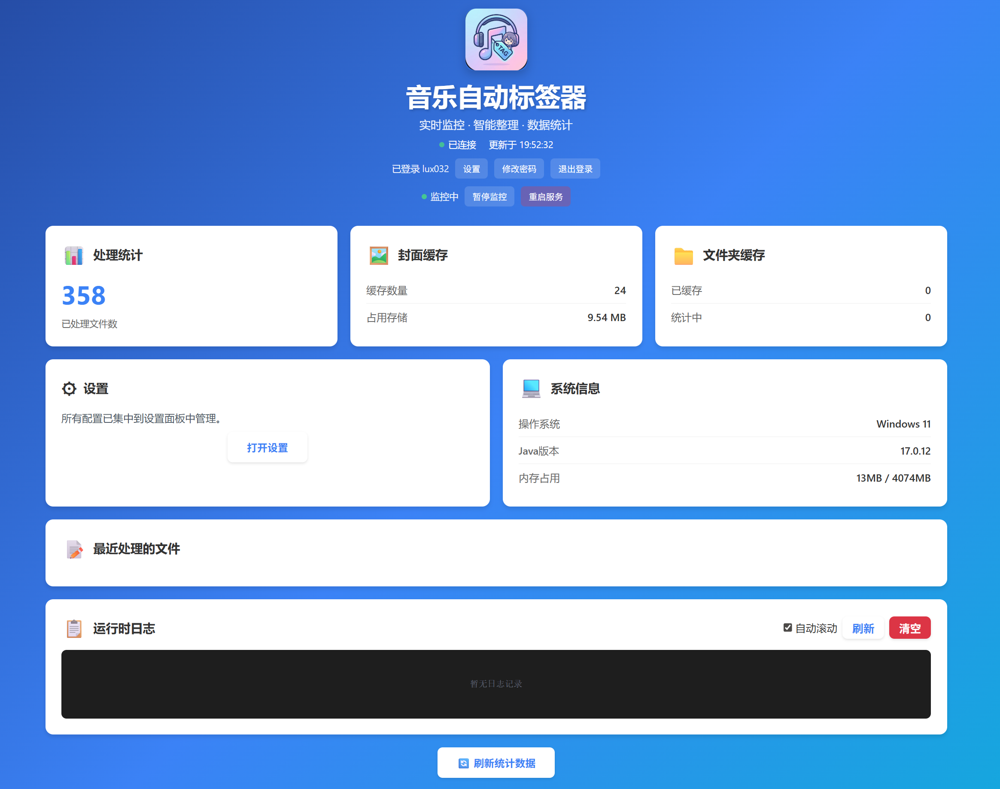

# 🎵 Music Auto Tagger | 音乐文件自动整理工具

<div align="center">


[](https://www.java.com/)
[](https://www.docker.com/)
[](https://musicbrainz.org/)
[](https://lrclib.net/)
[](LICENSE)

[简体中文](README_ZH.md) | [English](README.md)

</div>

**Music Auto Tagger** 是一个基于**音频指纹**和**时长序列指纹**的自动化音乐整理工具。它专为 NAS 和服务器环境设计，能够"监听"下载目录，自动识别音乐文件，补全元数据（包括歌词），并整理归档。

> **核心价值**: 告别杂乱无章的音乐文件夹，让你的音乐库自动拥有完美的标签、封面和歌词。

## 📊 Web 监控面板



内置实时监控面板提供：
- 📊 实时统计信息和处理进度
- 📝 最近处理的文件及详细元数据
- 📋 实时系统日志，支持自动滚动
- ⚙️ 系统配置和状态概览

## ✨ 核心特性

- 🎧 **音频指纹识别**：基于 **Chromaprint (AcoustID)**，即使文件名是乱码 (`track01.mp3`) 也能精准识别。
- 📝 **权威元数据**：数据源自 **MusicBrainz**，自动补全标题、艺术家、专辑、年份、**作曲**、**作词**等信息。
- 📜 **自动同步歌词**：🆕 集成 **LrcLib**，自动下载并嵌入 **同步歌词 (.lrc)**，完美支持现代播放器。
- 🖼️ **高清封面**：自动从 Cover Art Archive 下载并内嵌高清专辑封面。
- 📁 **自动化整理**：按照 `艺术家/专辑/歌曲名` 的结构自动重命名和归档文件。
- 🤖 **无人值守**：配合 qBittorrent/Transmission 使用，下载完成后自动处理，无需人工干预。
- ⚡ **智能扫描优化**：🆕 **两级识别策略 + 时长序列指纹 + 文件夹级缓存**
    - **第一级：快速扫描** - 基于标签和时长序列指纹匹配，90% 准确率即可通过
    - **第二级：指纹识别** - 仅在快速扫描失败时启用，保证识别率
    - **文件夹级缓存** - 同一专辑的后续文件直接使用缓存，跳过所有扫描
    - **性能提升**：处理一张 16 首的专辑，仅需 1 次完整扫描 + 15 次缓存查询
- 💾 **双模式持久化**：
    - **文本模式 (默认)**：无需数据库，使用 CSV 文件记录已处理文件，开箱即用，适合个人用户。
    - **MySQL 模式**：支持连接外部数据库，适合海量文件和高性能并发场景。
- 🐳 **Docker 部署**：提供轻量级 Docker 镜像，支持 Synology/QNAP/Unraid 等 NAS 系统。
- 🔄 **智能重试机制**：自动处理网络波动导致的识别失败，并提供失败文件隔离。
- 📊 **Web 监控面板**：🆕 内置实时监控面板，可视化查看处理进度、系统状态和运行日志。
- 🌐 **多语言支持**：🆕 支持中文和英文界面，可通过配置文件轻松切换语言，为全球用户提供本地化体验。

## ⚠️ 最佳实践：如何获得最精准的整理效果

由于音乐发行形式极其复杂（包含单曲 Single、迷你专辑 EP、正规专辑 Album、精选集 Best、豪华版 Deluxe 等），为了确保工具能将您的音乐精确归类到正确的专辑中，**强烈建议**遵循以下操作：

> **请将同一张专辑（或单曲）的音频文件放入一个单独的文件夹中**，然后再交由本工具处理。

❌ **不推荐**：将成百上千首不同歌手、不同专辑的歌曲混合堆放在同一个目录下。
✅ **推荐**：
  - `/Downloads/Jay_Chou_Fantasy/` (包含范特西整张专辑的歌曲)
  - `/Downloads/Adele_21/` (包含 21 整张专辑的歌曲)

**原因**：当文件被隔离在独立文件夹时，程序能结合上下文更好地判断它们属于同一张专辑，从而避免将正规专辑中的歌曲误匹配到后续发行的“精选集”或“单曲”版本中。
## 🚀 快速开始 (Docker Compose)

这是最简单的运行方式。无需安装 Java 环境。
配置在登录后设置面板完成。

1.  **创建 `docker-compose.yml`**
    ```yaml
    version: '3.8'
    services:
      music-tagger:
        image: ghcr.io/lux032/musicautotagger:latest
        container_name: music-tagger
        ports:
          - "8080:8080"
        environment:
          - PUID=1000
          - PGID=1000
          - UMASK=022
        volumes:
          - /path/to/downloads:/music
          - /path/to/music_library:/app/tagged_music
          - ./data:/app/data
          - ./config.properties:/app/config.properties
        restart: unless-stopped
    ```

    `PUID`/`PGID` 设置为 NAS 挂载目录所属用户/组的 UID/GID，`UMASK` 控制默认权限。

2.  **启动服务**
    ```bash
    docker-compose up -d
    ```

3.  **访问 Web 监控面板**

    启动后，在浏览器中访问 `http://localhost:8080` 即可查看实时监控面板。
    面板使用本地管理员账号，存放在 `data/admin.json`。
    第一次访问会提示创建管理员账号。
    如果 `config.properties` 不存在，程序启动时会自动生成默认配置。

    面板功能包括：
    - 📊 **实时统计**：已处理文件数、封面缓存、文件夹缓存等
    - 📝 **最近处理**：查看最近处理的音乐文件详情
    - 📋 **运行日志**：实时查看系统运行日志，支持自动滚动
    - ⚙️ **系统信息**：查看配置参数和系统状态

## 💻 本地运行

如果你想在本地开发或运行：

### 前置要求
- JDK 17+
- Maven 3.6+
- [Chromaprint (fpcalc)](https://acoustid.org/chromaprint) (需添加到系统 PATH)
- [FFmpeg](https://ffmpeg.org/) (需添加到系统 PATH)

### 编译与运行
```bash
# 1. 编译
mvn clean package

# 2. 运行
java -jar target/MusicDemo-1.0-SNAPSHOT.jar

# 3. 访问 Web 面板
# 浏览器打开 http://localhost:8080
```

配置会在首次启动时自动生成。
API Key/数据库/代理/路径/语言等在登录后设置面板中配置。

## 📚 文档指南

- **QNAP NAS 用户**：请参阅 [QNAP 部署指南](docs/QNAP_DEPLOYMENT_GUIDE.md)
- **数据库配置**：默认使用文件记录处理状态，如需使用 MySQL 请参阅 [数据库设置](docs/DATABASE_SETUP.md)
- **Windows 指南**：[Windows 构建与测试](docs/WINDOWS_BUILD_GUIDE.md)

## 贡献与支持

欢迎提交 Issue 或 Pull Request！

如果你觉得这个项目对你有帮助，请给个 ⭐ **Star** 支持一下！

## 📄 开源许可

本项目采用 [MIT License](LICENSE) 进行开源。

### 许可证说明

MIT 许可证是一个宽松的开源许可证，允许你：
- ✅ 商业使用
- ✅ 修改源代码
- ✅ 分发
- ✅ 私人使用

**唯一的要求**是：在软件的所有副本或重要部分中保留版权声明和许可声明。

### 第三方服务声明

本工具依赖以下第三方服务，请遵守它们各自的服务条款：
- [MusicBrainz](https://musicbrainz.org/) - 音乐元数据服务
- [AcoustID](https://acoustid.org/) - 音频指纹识别服务
- [LrcLib](https://lrclib.net/) - 歌词服务
- [Cover Art Archive](https://coverartarchive.org/) - 封面图片服务
- [FFmpeg](https://ffmpeg.org/) - 音频处理工具

---
**Disclaimer**: This tool relies on third-party services (MusicBrainz, AcoustID, LrcLib). Please respect their Terms of Service.
